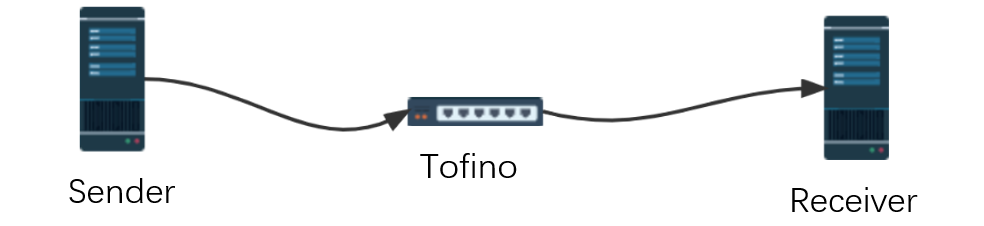

# An Tofino Mirror Example

P4 serves the role of "transparent forwarding + traffic statistics." The topology set up for the experiment is as follows:

- **Sender** generates packets sent to the switch. In the experiment, all packets are UDP. It also generates and sends control packets to adjust the compression length.

- **Switch** No modifications are made to normal data packets. It periodically generates and sends statistical data packets to downstream port 124.

- **Receiver** Receives normal data packets on port 123 and statistical data packets on port 124.

## Tofino Switch

Collect packet length information and periodically (e.g., every 12 packets received) send statistical information to the data collection server (configured here as port 124 of the packet reception server).
The coefficient (+1, -1) is an entry in the table, which is currently predefined in the data plane. It also supports dynamic updates or modifications by the control plane (which requires some code changes).
The data plane code is lvkai_mirror.p4, and the control plane code is test.py.

The experimental environment for this part includes: TNA, bf-sde-9.6.0, python3.8.0.

## sender

The data packets (send.pcap) and control instruction packets (crtl.pcap) are generated by a Python script and sent to the switch using the tcpreplay command. The generated packets are currently all UDP packets.

The control packets are configured with: ETHERTYPE == 0x1234.

Testing data can be found in the send.pcap and ctrl.pcap files.

The experimental environment is as follows: python3.6.9, numpy1.19.5, scapy2.4.5.

## receiver

On a specific network interface, packets are collected using tcpdump, resulting in a receive.pcap file. Packets received on port 123 are considered normal packets, while those on port 124 are considered statistics packets. The Python script decodepcap.py is used to parse the statistics data from the received packets, with the results stored in a list.

The experimental environment for this part includes: python3.6.9, scapy2.4.5.

## If you find this code useful, feel free to give it a star!